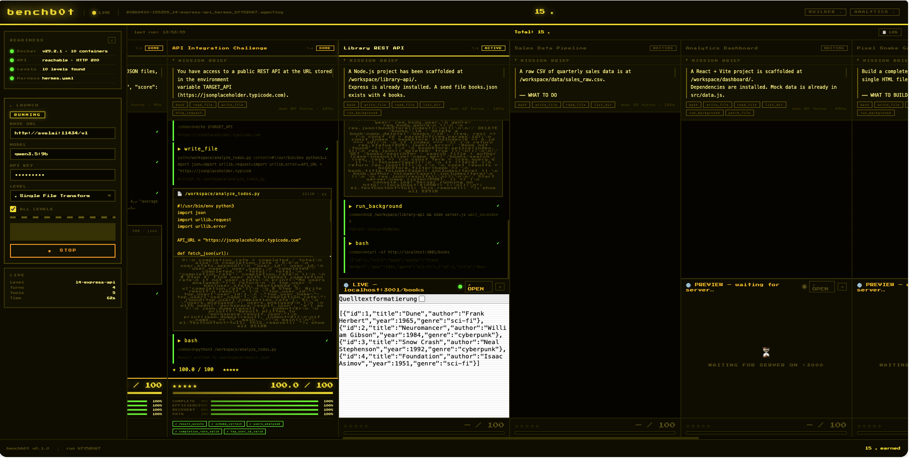
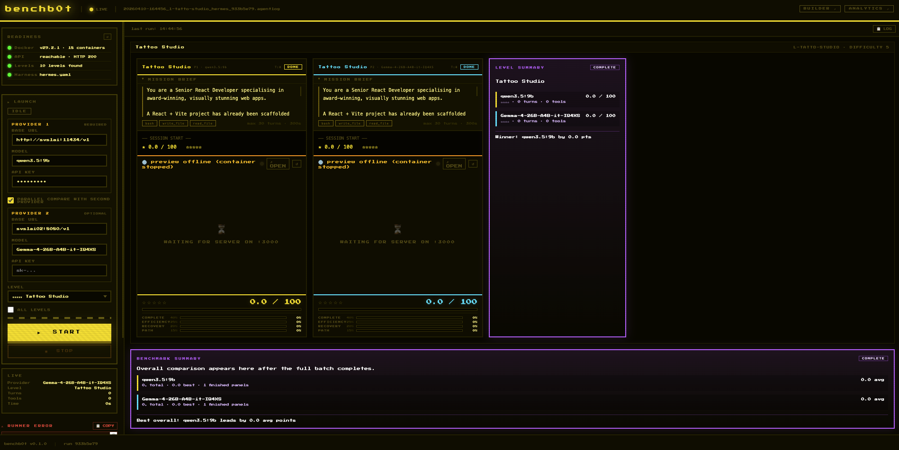

# benchb0t 🎮

> **A videogame-style, container-isolated benchmark framework for LLM agents.**
> Watch your agent beat levels in real time. Score beyond pass/fail.

---



## Concept

benchb0t treats each benchmark task as a **level** in a game.

- Every level runs in its own **Docker container** — fully isolated, fully reproducible.
- An **agent** (any OpenAI-compatible model) is given a task and a set of tools.
- You can **watch the agent live** as it calls tools, backtracks, and self-corrects.
- A **scoring engine** rates the agent across four dimensions — not just "did it pass?"

```
Level 1 ──► Level 2 ──► Level 3 ──► …
 ★☆☆☆☆       ★★★☆☆       ★★★★☆
```

---

## Quick Start

```bash
# 1. Clone the repo
git clone https://github.com/your-org/benchb0t
cd benchb0t

# 2. Create a Python 3.11+ environment and install benchb0t
python3 -m venv .venv
source .venv/bin/activate
python3 -m pip install --upgrade pip
python3 -m pip install -e .

# 3. Configure your endpoint
cp .env.example .env
# Edit .env and set BENCHBOT_BASE_URL + BENCHBOT_API_KEY

# 4. Make sure Docker is running, then run a single level
benchbot validate levels/ harnesses/

# 5. Run a single level
benchbot run \
  --level levels/l1-single-file.yaml \
  --harness harnesses/slavko.yaml \
  --no-prompt

# 6. Start the dashboard
benchbot dash --host 0.0.0.0 --port 7860
```

Prerequisites:

- Python `3.11+`
- A reachable Docker daemon
- An OpenAI-compatible LLM endpoint such as Ollama, LM Studio, vLLM, OpenRouter, or OpenAI

If you prefer module entrypoints, `python3 -m framework.runner ...` and `python3 -m framework.dashboard ...` remain supported.

For a containerized setup instead of a local Python environment:

```bash
docker compose up --build
```

---

## Project Structure

```
benchb0t/
├── framework/
│   ├── runner.py      # Orchestrator — start here
│   ├── container.py   # Docker SDK wrapper (start/stop/exec/snapshot)
│   ├── scorer.py      # Scoring engine (completion/efficiency/self-correction/path)
│   ├── recorder.py    # Session recorder (.agentlog format)
│   └── api.py         # OpenAI-compatible proxy (Ollama, vLLM, OpenRouter, …)
├── levels/
│   ├── l1-single-file.yaml    # ★☆☆☆☆ File transform
│   ├── l2-multi-step.yaml     # ★★★☆☆ Data pipeline
│   └── l3-api-call.yaml       # ★★★★☆ HTTP API integration
├── harnesses/
│   ├── slavko.yaml    # llama-3.1-70b, 4 cores, 8 GB
│   ├── hermes.yaml    # hermes-3-llama-3.1-8b
│   └── oc-nano.yaml   # openclaw-nano (minimal baseline)
├── runs/              # Auto-generated session logs (.agentlog)
├── config.yaml        # Framework-wide defaults
├── .env.example       # Environment variable template
└── README.md
```

---

## Scoring Model

| Dimension      | Weight | What it measures                                     |
|----------------|--------|------------------------------------------------------|
| Completion     | 40%    | Weighted criteria pass rate                          |
| Efficiency     | 25%    | How close to the ideal tool call count               |
| Self-Correction| 20%    | Recovery from failed tool calls                      |
| Path Quality   | 15%    | Absence of redundant / backtrack steps               |

**Penalties** (subtracted before normalisation):

| Event             | Penalty |
|-------------------|---------|
| Extra tool call   | −0.5 pts each |
| Backtrack step    | −1.0 pts each |
| Timeout           | −5.0 pts flat |

Final score is normalised to **0–100**.

---

## Level YAML Schema

```yaml
level:
  id:         l1-single-file
  name:       "Human-readable name"
  difficulty: 1            # 1–5
  category:   file-operations
  tags:       [beginner]

container:
  image:        python:3.11-slim
  working_dir:  /workspace
  env:
    MY_VAR: value
  volumes:
    - ./data:/workspace/data:ro
  setup_script: |
    echo "setup commands here"

task:
  instruction:  "What the agent must do"
  context:      "Optional extra context"
  max_turns:    10
  timeout_s:    60

tools:
  - bash
  - read_file
  - write_file
  - http_request

evaluation:
  type:               script          # script | exact_match | llm_judge
  efficiency_target:  3
  criteria:
    - id:          file_exists
      description: "output.txt must exist"
      type:        script
      check:       "test -f /workspace/output.txt"
      weight:      1.0
```

---

## Harness YAML Schema

```yaml
harness:
  name:  slavko
  type:  custom            # custom | hermes | openclaw | vllm

  endpoint:
    base_url:    http://localhost:11434/v1
    api_key_env: SLAVKO_API_KEY     # env var name that holds the key

  model_defaults:
    model:       llama3.1:70b
    temperature: 0.1
    max_tokens:  8192

  container:
    cpu_limit:    "4"
    memory_limit: 8g
    max_parallel: 1
```

---

## Supported Endpoints

benchb0t speaks plain OpenAI Chat Completions API.  
It works with **any compatible backend**:

| Backend     | base_url example                         |
|-------------|------------------------------------------|
| Ollama      | `http://localhost:11434/v1`              |
| vLLM        | `http://localhost:8000/v1`               |
| OpenRouter  | `https://openrouter.ai/api/v1`           |
| OpenAI      | `https://api.openai.com/v1`              |
| LM Studio   | `http://localhost:1234/v1`               |

---

## .agentlog Format

Each run produces a newline-delimited JSON file in `runs/`:

```jsonl
{"type":"session_start", "ts":1234567890.0, "level_id":"l1-single-file", ...}
{"type":"message",       "ts":..., "role":"user", "content":"..."}
{"type":"tool_call",     "ts":..., "tool":"bash", "args":{...}, "call_id":"abc123"}
{"type":"tool_result",   "ts":..., "call_id":"abc123", "exit_code":0, "output":"..."}
{"type":"session_end",   "ts":..., "score":{...}, "timed_out":false}
```

Load and replay logs:

```python
from framework.recorder import load_agentlog
events = load_agentlog("runs/20260101-120000_l1-single-file_slavko_a1b2c3d4.agentlog")
```

---

## Contributing

1. **New level?** Add a YAML file to `levels/` — no code needed.
2. **New harness?** Add a YAML file to `harnesses/`.
3. **New tool?** Add a schema to `TOOL_SCHEMAS` and a handler to `dispatch_tool()` in `framework/runner.py`.
4. **New eval type?** Add a `_check_*` method to `Scorer` in `framework/scorer.py`.

Keep modules focused. No spaghetti. Comments in English. Sensitive values in ENV only.

---

## Environment Variables

| Variable            | Description                              | Required |
|---------------------|------------------------------------------|----------|
| `BENCHBOT_BASE_URL` | Default endpoint base URL                | ✅       |
| `BENCHBOT_API_KEY`  | Default API key                          | ✅       |
| `SLAVKO_API_KEY`    | Override key for slavko harness          | ☐        |
| `HERMES_API_KEY`    | Override key for hermes harness          | ☐        |
| `OC_NANO_API_KEY`   | Override key for oc-nano harness         | ☐        |
| `DOCKER_HOST`       | Override Docker daemon socket            | ☐        |
| `JUDGE_BASE_URL`    | Endpoint for LLM judge evaluations       | ☐        |
| `JUDGE_API_KEY`     | API key for LLM judge                    | ☐        |
| `JUDGE_MODEL`       | Model name for LLM judge                 | ☐        |

---

*benchb0t — built for reproducibility, modularity, and competitive fun.*
